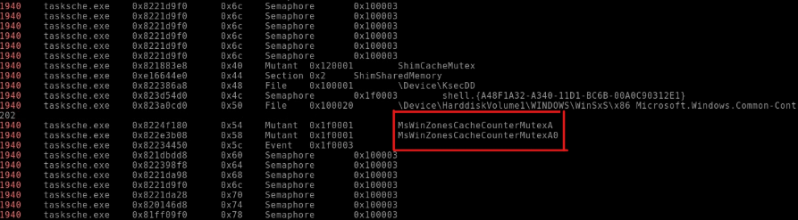

# Glossário

1. [Introdução](#1-introdução)
2. [Orientações](#2-orientações)
3. [Só código](#3-só-código)
4. [Sobre mim](#4-sobre-mim)
5. [Versão em Inglês](https://github.com/Samu3lb0az/WriupVolatiliry_English.git)
6. [Licença](LICENSE)

## **1. Introdução**

**Objetivo**: Este writeup foi desenvolvido para auxiliar na **compreensão das tarefas** do laboratório **TryHackMe Volatility – Task 10: Investigations**, oferecendo um guia prático de execução diretamente na máquina virtual disponibilizada pela plataforma. O ambiente já inclui todos os requisitos pré-instalados (Python 3, ferramentas do **Volatility** e arquivos de memória necessários), permitindo que você se concentre na análise forense sem preocupações com configurações.

**Ferramenta**: Volatility 3.

**Observação sobre `windows.info`**: ao usar o plugin `windows.info` após indicar o sistema operacional da imagem de memória, o Volatility não apenas confirma o SO, mas também exibe detalhes importantes como a versão exata do Windows, o tipo de arquitetura da máquina (por exemplo, x64 ou x86), e a versão do kernel em execução. Essas informações podem ser úteis para entender compatibilidades de plugins e interpretar melhor a saída de comandos.

**Uma dica que recebi de um amigo é que o próprio TryHackMe já fornece quantos caracteres e se haverá um caractere especial, assim facilitando a procura da resposta correta. Com essa pequena dica, consegui achar diversas respostas apenas analisando o que o plugin me trouxe.

## 2. Orientações

As orientações se aplicam à task 10 do módulo Volatility da plataforma TryHackMe, especificamente ao cenário de investigações forenses em imagens de memória.

É importante ressaltar que todas as atividades da task 10 são realizadas diretamente na máquina virtual do próprio TryHackMe, iniciável a partir da task 3.

---

**Enunciado: Qual é a versão de compilação da máquina host no Caso 001?**

Esse desafio é realizado com base nos conceitos apresentados nas tasks anteriores. Utilizamos o plugin `windows.info`, que fornece informações detalhadas do sistema operacional carregado na imagem de memória. No caso do **Caso 001**, o comando é:

```bash
vol -f /Scenarios/Investigations/Investigation-1.vmem windows.info
```

O plugin exibirá a versão de compilação (build) do Windows, além da edição do sistema e do tipo de máquina (x64). Use esses dados para responder ao enunciado.

---

**Enunciado: Em que momento o arquivo de memória foi adquirido no Caso 001?**

Neste desafio, reaproveitamos o plugin `windows.info`. Ao executar o mesmo comando acima, além da build, o Volatility apresenta o timestamp de aquisição da memória (data e hora em que o dump foi gerado). Essa informação está listada logo após os metadados do SO, o que facilita a localização do carimbo de data/hora exato.

```bash
vol -f /Scenarios/Investigations/Investigation-1.vmem windows.info
```

---

**Enunciado: Qual processo pode ser considerado suspeito no Caso 001?**
**Observação:** determinados caracteres especiais podem não estar visíveis na VM fornecida. Ao copiar e colar, eles ainda estarão presentes.

Para identificar o processo suspeito, usamos o plugin `windows.pslist`, que gera uma lista de todos os processos em execução, mostrando PID, PPID e nomes. A análise consiste em examinar processos atípicos ou com nomes mascarados, observando colunas de PID e PPID.

```bash
vol -f /Scenarios/Investigations/Investigation-1.vmem windows.pslist
```

Busque por entradas com nomes não familiares ou contendo caracteres especiais. Anote o nome completo do processo (indicando devidamente qualquer caractere invisível) para responder ao enunciado.

---

**Enunciado: Qual é o processo pai do processo suspeito no Caso 001?**

Esse enunciado dá sequência ao desafio anterior, utilizando novamente a saída de `windows.pslist`. Ao localizar a linha do processo suspeito, observe o valor da coluna **PPID** (Parent Process ID). Em seguida, procure o processo cujo **PID** coincide com esse PPID para descobrir o nome do processo pai.

```bash
vol -f /Scenarios/Investigations/Investigation-1.vmem windows.pslist
```

A identificação do processo pai requer apenas a leitura cruzada entre PPID e PID na mesma tabela de saída, tornando a busca direta e objetiva.

---

**Enunciado: Qual é o PID do processo suspeito no Caso 001?**

Novamente, com `windows.pslist`, localize a mesma linha do processo suspeito e copie o valor da coluna **PID**. Essa informação está imediatamente ao lado do nome do processo.

```bash
vol -f /Scenarios/Investigations/Investigation-1.vmem windows.pslist
```

---

**Enunciado: Qual é o PID do processo pai no Caso 001?**

Para este desafio, após determinar o processo pai no passo anterior, mantenha-se na saída de `windows.pslist` e copie o PID correspondente ao processo identificado como pai.

```bash
vol -f /Scenarios/Investigations/Investigation-1.vmem windows.pslist
```

---

**Enunciado: Qual user-agent foi empregado pelo adversário no Caso 001?**

Aqui combinamos dois plugins. Primeiro, usamos `windows.memmap` para mapear e despejar a memória do processo suspeito (PID obtido anteriormente). O parâmetro `--dump` gera arquivos de despejo:

```bash
vol -f /Scenarios/Investigations/Investigation-1.vmem windows.memmap --pid 1640 --dump
```

Em seguida, extraímos strings do despejo e filtramos pelo termo “User-Agent”:

```bash
strings *.dmp | grep -i "user-agent"
```

O resultado exibirá o valor exato do header `User-Agent` usado pelo malware.

---

**Enunciado: O Chase Bank foi um dos domínios bancários suspeitos encontrados no Caso 001? (Y/N)**

Com base no dump de memória e nas strings extraídas, identifique se “chase.com” ou variações aparecem entre os domínios listados. Se constatado, a resposta é **Y**, caso contrário, **N**.

---

**Enunciado: Qual processo suspeito está sendo executado no PID 740 no Caso 002?**

Para o **Caso 002**, altere apenas o arquivo de memória de entrada e repita a listagem de processos:

```bash
vol -f /Scenarios/Investigations/Investigation-2.raw windows.pslist
```

Localize a linha com PID 740 e copie o nome do processo suspeito ali mostrado.

---

**Enunciado: Qual é o caminho completo do binário suspeito no PID 740 no Caso 002?**

Utilize o plugin `windows.dlllist` para listar todas as bibliotecas e caminhos associados a processos em execução, filtrando pelo PID 740:

```bash
vol -f /Scenarios/Investigations/Investigation-2.raw windows.dlllist | grep 740
```

O caminho completo do executável estará entre as entradas listadas para esse PID.

---

**Enunciado: Qual é o processo pai do PID 740 no Caso 002?**

Reutilize `windows.pslist` no **Caso 002** e, da mesma forma que no Caso 001, identifique a coluna PPID da linha com PID 740, depois encontre o processo cujo PID corresponde a esse PPID.

```bash
vol -f /Scenarios/Investigations/Investigation-2.raw windows.pslist
```

---

**Enunciado: Qual é o PID do processo pai suspeito conectado ao descriptografador no Caso 002?**

Novamente, a partir da tabela de `windows.pslist`, encontre o PID do processo pai que interage com o descriptografador, observando as colunas PID e PPID.

---

**Enunciado: Pelas nossas informações atuais, que malware está presente no sistema no Caso 002?**

Com base no nome do processo (por exemplo, “@WanaDecryptor@”), correlacione com malwares conhecidos. No cenário, o processo corresponde ao **WannaCry**.

---

**Enunciado: Qual DLL é carregada pelo descriptografador usado para criação de soquete no Caso 002?**

Use `windows.dlllist` novamente, filtrando pelo PID do processo descriptografador (740), e identifique a DLL responsável pela criação de sockets:

```bash
vol -f /Scenarios/Investigations/Investigation-2.raw windows.dlllist | grep 740
```

Obs.: preste atenção em DLLs como `ws2_32.dll` ou similares, que indicam chamadas de rede.

---

**Enunciado: Que mutex pode ser encontrado como um indicador conhecido do malware em questão no Caso 002?**

Para descobrir o mutex utilizado pelo malware, usamos o plugin `windows.handles` e filtramos pela thread ou PID correspondente:

```bash
vol -f /Scenarios/Investigations/Investigation-2.raw windows.handles | grep 1940
```

Sendo o plugin utilizado o `handles`, e o `grep`. Após toda a informação trazida após o plugin ser executado, é possível achar dois elementos, sendo um deles a resposta:



---

**Enunciado: Qual plugin poderia ser usado para identificar todos os arquivos carregados do diretório de trabalho do malware no Caso 002?**

Este não teve como, a parti para a pesquisa. Não tem muito segredo — uma breve busca já te traz a resposta.

---

## 3. Só código

Códigos usados:

```bash
vol -f /Scenarios/Investigations/Investigation-1.vmem windows.info
```

```bash
vol -f /Scenarios/Investigations/Investigation-1.vmem windows.pslist
```

```bash
vol -f /Scenarios/Investigations/Investigation-1.vmem windows.memmap --pid 1640 --dump
```

```bash
strings *.dmp | grep -i "user-agent"
```

```bash
vol -f /Scenarios/Investigations/Investigation-2.raw windows.pslist
```

```bash
vol -f /Scenarios/Investigations/Investigation-2.raw windows.dlllist | grep 740
```


*Recomendo revisar o tópico [Orientações](#2-orientações) para evitar conflitos ou mal-entendidos.*

---

## 4. Sobre mim

**Samuel
**Desenvolvedor Full-Stack | Estudante de Segurança Cibernética

-  **Mais
Sou desenvolvedor full-stack que está em busca de aprendaer e aprimirar minhas técnicas em segurança cibernética

-  **Prática em Cybersecurity**:  
  Aprimoro habilidades através de labs práticos no **TryHackMe**, como o *LAB: Volatility*, onde analiso *memory dumps* para investigar ataques, extrair artefatos maliciosos (processos ocultos, DLL injection) e reconstruir cenários de comprometimento.

-  **Onde me achar

- Linkedin: www.linkedin.com/in/samuel-boaz-gonçalves
- GitHub: https://github.com/Samu3lb0az
